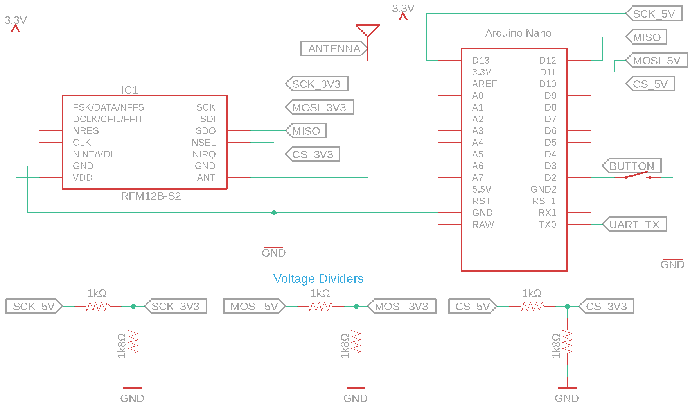

# AVR

This directory contains the AVR platform implementation for the RFM12B PING/PONG example.

The platform layer provides the AVR-specific initialization, SPI communication, timing, button handling, and serial output required by the common example application.

See the [main PING/PONG README](../README.md) for a description of the example and how it operates.

## Hardware

The AVR platform implementation was developed and tested using an **ATmega328P-based Arduino Nano**.

The example requires:

* ATmega328P / Arduino Nano
* RFM12B radio module
* Momentary push button
* Serial connection for diagnostic output
* Appropriate antenna for the RFM12B frequency band

The RFM12B is connected to the ATmega328P hardware SPI peripheral. The push button connects the button input to ground when pressed and uses the ATmega328P internal pull-up resistor.

### Voltage Levels

The Arduino Nano used by this example operates at 5 V while the RFM12B operates at 3.3 V. The 5 V signals from the ATmega328P must therefore be reduced before being connected to the RFM12B.

The `CS`, `MOSI`, and `SCK` signals each use a resistor voltage divider consisting of **1.0 kΩ (1%)** between the ATmega328P output and the RFM12B input, and **1.8 kΩ (1%)** between the RFM12B input and ground. This reduces a 5 V output to approximately 3.3 V.

* The same divider is used independently for each of the three signals.
* The RFM12B `MISO` output is connected directly to the ATmega328P `MISO` input.

### Schematic



### Pin Assignments

| Function    | ATmega328P Pin | Arduino Nano Pin |
| ----------- | -------------- | ---------------- |
| RFM12B CS   | PB2            | D10              |
| RFM12B MOSI | PB3            | D11              |
| RFM12B MISO | PB4            | D12              |
| RFM12B SCK  | PB5            | D13              |
| Push button | PD2            | D2               |
| UART TX     | PD1 / TXD      | TX / D1          |

## Platform Implementation

The AVR platform layer uses the ATmega328P hardware SPI peripheral to communicate with the RFM12B and UART0 for diagnostic output at 115200 baud. SPI operates in mode 0, MSB first, with a 2 MHz clock. Timer2 generates a 1 ms interrupt used to debounce the push button, with a button press reported as a one-shot event after 25 ms of stable input.

The functions defined by the common `platform.h` interface are implemented as follows:

| Function                        | AVR Implementation                                                                    |
| ------------------------------- | ------------------------------------------------------------------------------------- |
| `platform_initialize()`         | Initializes UART0, SPI, the push button, and Timer2 with interrupts disabled          |
| `platform_start_interrupts()`   | Enables global AVR interrupts                                                         |
| `platform_delay_ms()`           | Provides a blocking millisecond delay using `_delay_ms()`                             |
| `platform_button_pressed()`     | Returns and clears the debounced button-press event                                   |
| `platform_rfm12_spi_transfer()` | Performs a 16-bit SPI transaction with the RFM12B and controls its chip-select signal |

## Build and Flash

The example is built using the AVR GCC toolchain and flashed using `avrdude`. The supplied Makefile targets an ATmega328P running at 16 MHz.

The Makefile assumes the ATmega328P is running an Arduino-compatible Optiboot bootloader configured for 115200-baud serial programming. Other bootloaders or programming methods, such as an ISP programmer, require changing the `avrdude` settings in the Makefile.

From the `atmega328p` directory, build the example with:

```sh
make
```

The resulting ELF and Intel HEX files are written to the `build/` directory.

To flash the Arduino Nano:

```sh
make flash
```

Before flashing, verify the programmer and serial port settings near the top of the Makefile:

```make
PROGRAMMER = arduino
PORT       = /dev/tty.usbserial-A900DIO1
BAUD       = 115200
```

The `PORT` value must be changed to match the serial device assigned to the Arduino Nano on the development system.

To remove generated build files:

```sh
make clean
```

## Running the Example

After flashing the firmware, connect to the Arduino Nano serial port using a terminal configured for **115200 baud, 8 data bits, no parity, and 1 stop bit (115200 8N1)**.

Reset or power-cycle the board. After initialization, the example prints the initial RFM12B status followed by:

```text
RFM12 PING/PONG example ready
```

Pressing the push button initiates a PING transmission. Serial output reports transmitted and received PING/PONG messages as the example runs.

Two RFM12B nodes running the example are required to demonstrate the complete PING/PONG exchange. Both radios must use compatible RF configuration and operate on the same frequency.

## Platform Notes

This platform implementation assumes a **16 MHz ATmega328P** and uses the following MCU peripherals:

* Hardware SPI for RFM12B communication
* UART0 for diagnostic output
* Timer2 for the 1 ms button debounce timer
* Internal pull-up resistor on the push-button input pin
