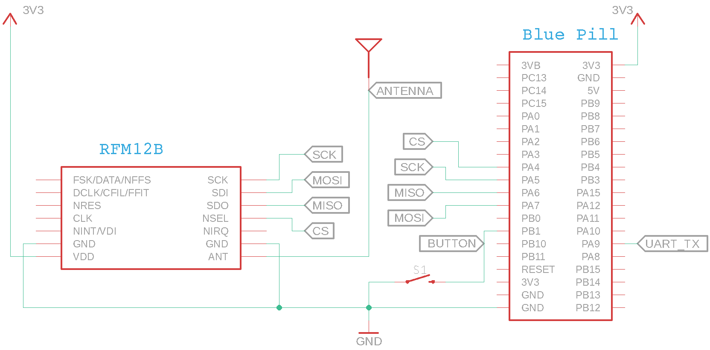

# STM32F103

This directory contains the STM32F103 platform implementation for the RFM12B PING/PONG example.

The platform layer provides the STM32F103-specific initialization, SPI communication, timing, button handling, and serial output required by the common example application.

See the [main PING/PONG README](../README.md) for a description of the example and how it operates.

## Hardware

The STM32F103 platform implementation was developed and tested using an **STM32F103C8-based Blue Pill** development board.

The example requires:

* STM32F103C8 / Blue Pill
* RFM12B radio module
* Momentary push button
* Serial connection for diagnostic output
* Appropriate antenna for the RFM12B frequency band

The RFM12B is connected to the STM32F103 SPI1 peripheral. Both the STM32F103 and RFM12B use 3.3 V logic, so the SPI signals can be connected directly between the devices.

The push button connects the button input to ground when pressed and uses the STM32F103 internal pull-up resistor.

### Schematic



### Pin Assignments

| Function    | STM32F103 | Blue Pill | RFM12B |
| ----------- | --------- | --------- | ------ |
| SPI CS      | PA4       | A4        | nSEL   |
| SPI MOSI    | PA7       | A7        | SDI    |
| SPI MISO    | PA6       | A6        | SDO    |
| SPI SCK     | PA5       | A5        | SCK    |
| Push button | PB1       | B1        | —      |
| UART TX     | PA9 / TX  | A9        | —      |


## Platform Implementation

The STM32F103 platform layer uses SPI1 to communicate with the RFM12B and USART1 for diagnostic output at 115200 baud. SPI operates in mode 0, MSB first, with a 2.25 MHz clock. SysTick generates a 1 ms interrupt used to debounce the push button, with a button press reported as a one-shot event after 25 ms of stable input.

The functions defined by the common `platform.h` interface are implemented as follows:

| Function                        | STM32F103 Implementation                                                   |
| ------------------------------- | -------------------------------------------------------------------------- |
| `platform_initialize()`         | Initializes the system clock, USART1, SPI1, push button, and SysTick       |
| `platform_start_interrupts()`   | Enables global interrupts                                                  |
| `platform_delay_ms()`           | Provides a blocking millisecond delay using SysTick                        |
| `platform_button_pressed()`     | Returns and clears the debounced button-press event                        |
| `platform_rfm12_spi_transfer()` | Performs a 16-bit SPI transaction with the RFM12B and controls chip select |

## Build and Flash

The example is built using the ARM GNU toolchain and flashed using `st-flash`. The supplied Makefile targets an STM32F103xB Cortex-M3 device.

The Makefile requires the `CMSISBASE` environment variable to point to the CMSIS source tree used for the build. The current Makefile was developed against a lightly modified CMSIS directory layout, so the expected paths may differ from other CMSIS distributions. In particular, the Makefile expects the STM32F1 device headers, system source, startup file, and linker script to be available beneath `CMSISBASE`.

Before building, `CMSISBASE` must point to the CMSIS source tree. It can either be defined in the environment:

```sh
export CMSISBASE=/path/to/cmsis
make
```

or supplied directly to `make`:

```sh
make CMSISBASE=/path/to/cmsis
```

Either command should be run from the `stm32f103` directory.


The resulting ELF and binary files are written to the `build/` directory.

To flash the Blue Pill using an ST-Link programmer:

```sh
make flash
```

The Makefile uses `st-flash` to write the binary image to the STM32F103 flash starting at address `0x08000000`.

To remove generated build files:

```sh
make clean
```

## Running the Example

After flashing the firmware, connect a serial adapter to the Blue Pill USART1 transmit pin and open a terminal configured for **115200 baud, 8 data bits, no parity, and 1 stop bit (115200 8N1)**.

Reset or power-cycle the board. After initialization, the example prints the initial RFM12B status followed by:

```text
RFM12 PING/PONG example ready
```

Pressing the push button initiates a PING transmission. Serial output reports transmitted and received PING/PONG messages as the example runs.

Two RFM12B nodes running the example are required to demonstrate the complete PING/PONG exchange. Both radios must use compatible RF configuration and operate on the same frequency.

## Platform Notes

This platform implementation assumes an **STM32F103C8-based Blue Pill** with an 8 MHz external crystal and configures the MCU to run at 72 MHz. It uses CMSIS definitions and direct peripheral register access rather than the STM32 HAL.

The following MCU peripherals are used:

* SPI1 for RFM12B communication
* USART1 for diagnostic output
* SysTick for the 1 ms button debounce timer and blocking delays
* Internal pull-up resistor on the push-button input pin
